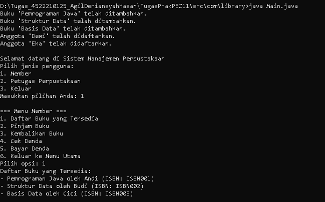
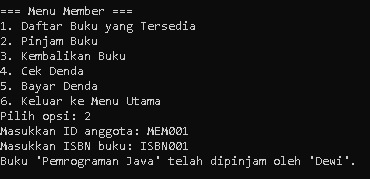
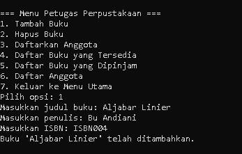
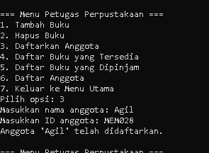
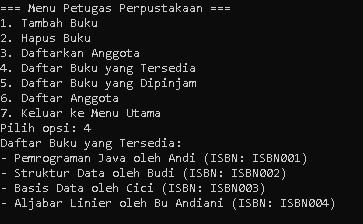
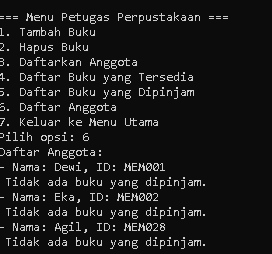

# 📜Tugas

### 1. Jika kamu membaca source code dengan seksama, pasti mengerti objek member dan objek buku. Sebutkan objek-objek tersebut!

#### Jawab :
Book :
- Judul (Title)
- Pengarang (Author) 
- ISBN 
- Status Peminjaman (isBorrowed) 
- Tanggal Peminjaman (borrowDate) 
- Tanggal Pengembalian (dueDate).

Member :

- Nama (name)
- ID
- Daftar Buku yang dipinjam (borrowedBooks)
- Jumlah Denda (fine).

### 2. Buatkan skenario member mencari buku, meminjam buku

#### Jawab : 

- Member mencari buku dengan melihat daftar buku yang tersedia.

- Jika buku tersedia, member memasukkan ID-nya dan ISBN buku yang ingin dipinjam.

### 3. Buatkan skenario petugas menambah buku, menambah member, melihat daftar buku, melihat daftar member

#### Jawab : 

- Petugas menambah buku baru dengan memberikan data judul, pengarang, dan ISBN.
- Petugas mendaftarkan anggota baru dengan memasukkan nama dan ID anggota.
- Petugas dapat melihat daftar buku yang tersedia dan daftar anggota yang terdaftar.

### 4. Printscreen setiap output dari skenario nomor 2 dan 3

#### Jawab : 

### No 2

### Daftar Buku yang Tersedia
 

### Member Meminjam Buku
  

### No 3

### Petugas Menambahkan Buku

### Petugas Mendaftarkan Anggota
  

### Petugas Mengecek Buku yang Tersedia
  

### Petugas Mengecek Member/Anggota
  

## 👨‍💻Kontribusi

  <b>Agil Deriansyah Hasan</b> 
  <i>4522210125</i>

